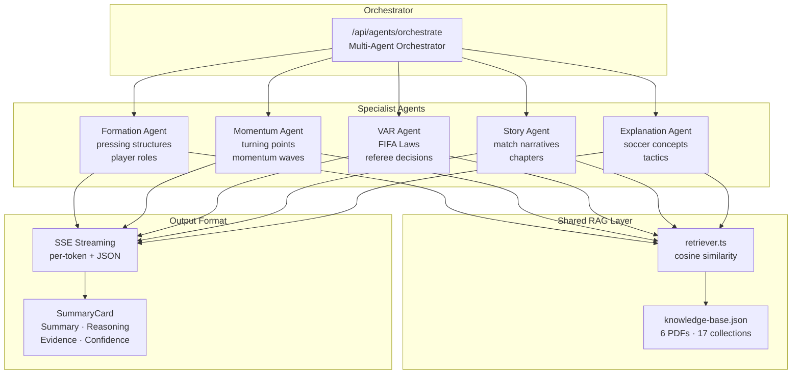

# PitchIQ AI — Explainable Soccer Intelligence

> Understand soccer through explainable AI. Built for FIFA World Cup fan engagement with transparency, reasoning, and trust.

**PitchIQ AI** is a multi-agent explainable soccer intelligence platform. It helps fans understand matches through tactical analysis, VAR explanations, match storytelling, momentum analysis, and an interactive AI companion — all with per-token SSE streaming, confidence scores, and cited evidence. No black boxes.

---

## Features

### 1. Formation Analysis (`/formation`)
Analyze team formations and pressing structures.

- Select a match and formation (4-3-3, 4-4-2, 3-4-3, etc.)
- AI identifies pressing triggers, defensive shape, and attacking patterns
- Output: formation breakdown, pressing structure with heatmap visualization, player role analysis

### 2. Momentum Analysis (`/momentum`)
Track momentum shifts throughout a match.

- Visual chart shows which team is dominating
- AI detects key turning points (goals, cards, substitutions)
- Output: wave chart, turning point timeline, momentum summary

### 3. VAR Explainer (`/var`)
Understand referee and VAR decisions with clear FIFA law citations.

- Pick a match event or describe an incident — the AI retrieves relevant FIFA Laws
- Output: decision summary, applicable law, reasoning, confidence score, fan-friendly explanation

### 4. Tactical Explainer (`/tactical`)
Analyze formations, momentum shifts, and key turning points.

- Input match events and statistics (7 sample matches + live ESPN fetch)
- AI identifies tactical adjustments and momentum swings
- Output: tactical summary, momentum analysis, turning points with timestamps, formation impact

### 5. Match Story Generator (`/story`)
Convert match statistics into compelling narratives.

- Load any match or fetch live data from ESPN
- AI structures the game into chapters with turning points
- Output: full narrative, chapter sections, key moments, summary one-liner

### 6. AI Soccer Companion (`/chat`)
Interactive chat that adapts to your knowledge level.

- Four expertise levels: Beginner, Intermediate, Expert, Child
- Context-aware RAG for rules and tactical queries
- Streaming responses with citations
- Web search for recent match data via ESPN
- Match-aware suggestions and context chips

---

## Architecture



```
pitchiq-ai/
├── src/
│   ├── app/
│   │   ├── api/
│   │   │   ├── agents/
│   │   │   │   ├── formation/route.ts      # SSE streaming agent
│   │   │   │   ├── momentum/route.ts       # SSE streaming agent
│   │   │   │   ├── var/route.ts            # SSE streaming agent
│   │   │   │   ├── story/route.ts          # SSE streaming agent
│   │   │   │   ├── explanation/route.ts    # SSE streaming agent
│   │   │   │   └── orchestrate/route.ts    # Multi-agent orchestrator
│   │   │   ├── chat/route.ts               # Streaming AI chat with RAG + web search
│   │   │   ├── matches/
│   │   │   │   ├── search/route.ts         # ESPN match search
│   │   │   │   └── fetch/route.ts          # ESPN match detail fetch
│   │   │   ├── var/route.ts                # VAR decision analysis (structured)
│   │   │   ├── tactical/route.ts           # Tactical match analysis
│   │   │   ├── story/route.ts              # Match narrative generation
│   │   │   └── ingest/route.ts             # Knowledge base ingestion
│   │   ├── formation/page.tsx              # Formation analysis page
│   │   ├── momentum/page.tsx               # Momentum analysis page
│   │   ├── var/page.tsx                    # VAR Explainer page
│   │   ├── tactical/page.tsx               # Tactical Explainer page
│   │   ├── story/page.tsx                  # Story Generator page
│   │   ├── chat/page.tsx                   # Chat Assistant page
│   │   ├── page.tsx                        # Home page with quick-start
│   │   ├── layout.tsx                      # Root layout with LayoutShell
│   │   └── globals.css                     # Tailwind v4 + custom CSS
│   ├── components/
│   │   ├── design-system/                  # TacticalCard, MatchBadge, MatchButton, etc.
│   │   ├── match/
│   │   │   ├── MatchSelector.tsx           # Universal match picker (samples + ESPN fetch)
│   │   │   ├── MatchSetupPanel.tsx         # Shared input panel
│   │   │   ├── EventTimelineBuilder.tsx    # Visual event timeline editor
│   │   │   ├── StatsEditor.tsx             # Collapsible match stats grid
│   │   │   ├── SummaryCard.tsx             # Summary-first expandable result card
│   │   │   ├── MatchContextChips.tsx       # Chat context chips + agent quick-ask
│   │   │   └── LiveMatchCard.tsx           # Live match score card
│   │   ├── football/
│   │   │   ├── Pitch.tsx                   # SVG pitch
│   │   │   ├── PitchMarkings.tsx           # Pitch markings (FIFA-proportioned)
│   │   │   ├── FormationVisual.tsx         # Formation lineup visualizer
│   │   │   ├── MomentumWave.tsx            # Momentum wave chart
│   │   │   ├── HeatmapPitch.tsx            # SVG pitch with heatmap zones
│   │   │   ├── VARIncidentMarker.tsx       # VAR incident pitch marker
│   │   │   ├── Scoreboard.tsx              # TV-style scoreboard overlay
│   │   │   ├── StatPill.tsx                # Stat display pill
│   │   │   └── AgentAvatar.tsx             # Per-agent icon/color config
│   │   ├── var/                            # VAR-specific components
│   │   ├── tactical/                       # Tactical-specific components
│   │   ├── story/                          # Story-specific components
│   │   ├── chat/                           # Chat-specific components (ChatWindow, MessageBubble, etc.)
│   │   └── layout/
│   │       ├── LayoutShell.tsx             # Hides nav/sidebar on chat route
│   │       ├── StadiumHeader.tsx           # Page header with match context
│   │       ├── StadiumFooter.tsx           # Footer
│   │       ├── BroadcastBar.tsx            # Fixed top bar with score
│   │       └── TunnelNav.tsx               # Agent navigation sidebar
│   ├── hooks/
│   │   ├── useAgentStream.ts               # SSE streaming hook with analysis cache
│   │   ├── useFanPreferences.ts            # Persist expertise level + fav team
│   │   └── useMatchParams.ts               # URL param sync for match context
│   ├── contexts/
│   │   └── MatchContext.tsx                # Match state with selection, computed scores, analysis cache
│   ├── lib/
│   │   ├── agent-stream.ts                 # Generic SSE streaming response helper
│   │   ├── openrouter.ts                   # OpenRouter AI client with message-array history
│   │   ├── prompts.ts                      # System prompts for each feature
│   │   ├── match-fetcher.ts                # ESPN API client for match search + details
│   │   ├── web-search.ts                   # ESPN-based web search for recent data
│   │   ├── orchestrator.ts                 # Multi-agent orchestration logic
│   │   ├── utils.ts                        # Utility functions (cn, etc.)
│   │   └── rag/
│   │       ├── embeddings.ts               # Text embedding via OpenRouter + hash fallback
│   │       ├── retriever.ts                # ChromaDB + JSON KB vector search
│   │       └── ingest.ts                   # Knowledge ingestion pipeline
│   └── agents/                             # Agent classes (VAR, formation, momentum, story, explanation)
├── data/
│   ├── sample-matches.json                 # 7 World Cup matches with events & stats
│   ├── knowledge-base.json                 # Pre-chunked PDF content for RAG (6 PDFs)
│   └── pdfs/                               # Source PDFs (FIFA laws, tactical guides, etc.)
├── types/
│   └── index.ts                            # All TypeScript type definitions
├── chroma-service/                         # Optional ChromaDB Docker setup
├── .env.example                            # Environment variable template
├── package.json                            # npm run dev, npm run build
└── README.md
```

## Tech Stack

| Layer | Technology |
|-------|-----------|
| Framework | Next.js 16 (App Router, Turbopack) |
| Language | TypeScript |
| Styling | TailwindCSS v4 + shadcn/ui + tw-animate-css |
| AI Model | OpenAI / OpenRouter API (configurable) |
| RAG | ChromaDB (optional) with JSON KB fallback using hash embeddings + cosine similarity |
| SSE Streaming | Web ReadableStream + per-token events |
| Match Data | ESPN public API (no key required) + sample JSON data |
| Deployment | Vercel (frontend + API routes) |

## Explainability

Every AI response includes four components:

1. **Summary** — Direct answer to the question (shown first)
2. **Reasoning** — Step-by-step logic chain (expandable)
3. **Evidence** — Specific rules, statistics, or tactical concepts (RAG-retrieved from PDFs)
4. **Confidence Score** — 0-100 with High/Medium/Low badge

## Setup

### Prerequisites

- Node.js 18+
- npm
- OpenRouter API key ([get one free](https://openrouter.ai/keys))

### Local Development

```bash
# Clone and install
git clone <repo-url>
cd pitchiq-ai
npm install

# Set up environment
cp .env.example .env.local
# Edit .env.local and add your OPENROUTER_API_KEY

# Run the dev server
npm run dev
```

Open [http://localhost:3000](http://localhost:3000) to see the app.

### Optional: ChromaDB

For better RAG vector search (instead of the built-in JSON fallback):

```bash
docker compose -f chroma-service/docker-compose.yml up -d
```

The app works without ChromaDB — all features fall back to the pre-ingested JSON knowledge base.

## API Routes

### Agent Routes (SSE Streaming)

| Route | Method | Description |
|-------|--------|-------------|
| `/api/agents/formation` | POST | Formation analysis (SSE streaming) |
| `/api/agents/momentum` | POST | Momentum analysis (SSE streaming) |
| `/api/agents/var` | POST | VAR incident analysis (SSE streaming) |
| `/api/agents/story` | POST | Story generation (SSE streaming) |
| `/api/agents/explanation` | POST | Explain any soccer concept (SSE streaming) |
| `/api/agents/orchestrate` | POST | Multi-agent orchestration (SSE streaming) |

### Structured Routes

| Route | Method | Description |
|-------|--------|-------------|
| `/api/var` | POST | Analyze a VAR incident (structured response) |
| `/api/tactical` | POST | Analyze match tactics |
| `/api/story` | POST | Generate match narrative |
| `/api/chat` | POST | Chat with AI (SSE streaming, RAG + web search) |
| `/api/ingest` | POST | Ingest knowledge (admin) |

### Match Data Routes

| Route | Method | Description |
|-------|--------|-------------|
| `/api/matches/search` | POST | Search FIFA World Cup matches by year (ESPN) |
| `/api/matches/fetch` | POST | Fetch full match details (ESPN) |

## Sample Data

Seven World Cup 2022 matches included:

| Match | Stage | Score | Events |
|-------|-------|-------|--------|
| Argentina vs France | Final | 3-3 (4-2 pens) | 12 |
| Argentina vs Netherlands | Quarter-final | 2-2 (4-3 pens) | 10 |
| France vs Morocco | Semi-final | 2-0 | 8 |
| Brazil vs Croatia | Quarter-final | 1-1 (2-4 pens) | 8 |
| England vs France | Quarter-final | 1-2 | 10 |
| Portugal vs Morocco | Quarter-final | 0-1 | 6 |
| Argentina vs Saudi Arabia | Group stage | 1-2 | 8 |

Each match includes full events (goals, cards, subs), formations, and match statistics. You can also fetch live FIFA World Cup matches by year via the ESPN integration.

## Key Components

| Component | Description |
|-----------|-------------|
| `MatchSelector` | Universal match picker with search + ESPN year fetch |
| `MatchSetupPanel` | Shared input panel used by all 5 agent pages |
| `EventTimelineBuilder` | Visual timeline editor with event type icons |
| `SummaryCard` | Summary-first expandable result card with confidence badge |
| `PitchMarkings` | SVG pitch with FIFA-proportioned markings |
| `HeatmapPitch` | SVG pitch with configurable heatmap zones |
| `Scoreboard` | TV-style scoreboard overlay |
| `BroadcastBar` | Fixed top bar with live indicator, score, and time |
| `LayoutShell` | Route-aware layout that hides nav chrome on chat |
| `useAgentStream` | SSE streaming hook with cross-page analysis cache |
| `ChatWindow` | Full chat UI with streaming, expertise selector, and agent context chips |

## RAG System

6 PDFs are pre-chunked and embedded:

- `fifa-laws-of-the-game.pdf` — FIFA Laws of the Game
- `referee-guidelines.pdf` — Referee guidelines
- `tactical-analysis-guide.pdf` — Tactical concepts
- `soccer-coaching-manual.pdf` — Coaching methodology
- `formation-patterns.pdf` — Formation patterns
- `momentum-patterns.pdf` — Momentum analysis patterns

Every agent retrieves relevant context from these PDFs before generating responses. Falls back to a bundled JSON knowledge base when ChromaDB is unavailable — zero external dependencies required.

## License

MIT
